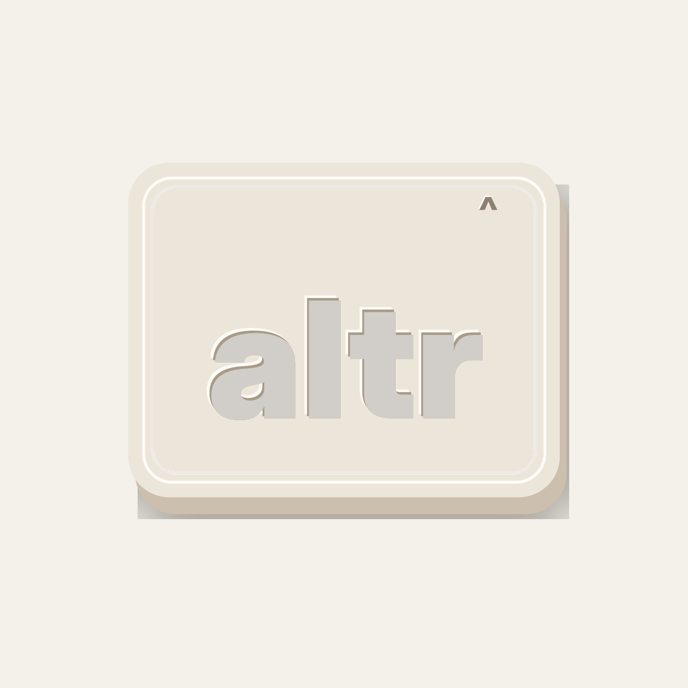
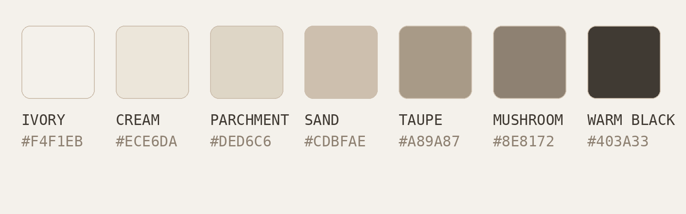

# altr Brand System

A compact brand package for **altr** — a small-business consulting firm modernizing how people work. The logo system is built around a tactile keycap container, referencing the `ALT` key as a metaphor for changing modes, unlocking a better workflow, and pressing into a more intentional way of working.

## Primary logo

The primary logo is the lowercase wordmark **altr** embedded into a rounded keycap form. The keycap should feel physical, useful, and modern — tactile enough to be memorable, but restrained enough to work across business decks, websites, proposals, social media, and product-style interfaces.

## Logo assets

Use these exported PNGs when building future assets:

| Asset | File | Use |
|---|---|---|
| Key logo on ivory | `assets/altr_key_logo_cream_taupe_on_ivory.png` | Hero sections, thumbnails, covers, slide title pages |
| Key logo, transparent | `assets/altr_key_logo_cream_taupe_transparent.png` | Compositing onto custom backgrounds |
| Key logo, no shadow, transparent | `assets/altr_key_logo_cream_taupe_no_shadow_transparent.png` | Clean layouts, small spaces, UI, documents |
| Wordmark taupe, transparent | `assets/altr_wordmark_taupe_transparent.png` | Headers, footers, decks, watermark moments |
| Wordmark warm black, transparent | `assets/altr_wordmark_warm_black_transparent.png` | High-contrast documents and light backgrounds |
| Wordmark ivory, transparent | `assets/altr_wordmark_ivory_transparent.png` | Dark backgrounds |
| Social avatar | `assets/altr_social_avatar_ivory.png` | LinkedIn, X, YouTube, profile images |
| Color palette | `assets/altr_color_palette.png` | Quick reference |
| Original reference image | `assets/altr_reference_cream_logo.jpeg` | Visual source reference |

## Exact color palette

These are the working production colors for the cream/taupe identity. The logo should primarily use **Cream on Ivory with Taupe lettering**.

| Token | Hex | Role |
|---|---:|---|
| Ivory | `#F4F1EB` | Primary background, whitespace, deck canvas |
| Cream | `#ECE6DA` | Primary keycap face |
| Parchment | `#DED6C6` | Secondary background, panels, soft UI surfaces |
| Sand | `#CDBFAE` | Keycap side/lip, dividers, subtle depth |
| Taupe | `#A89A87` | Primary wordmark, logo emboss, muted text |
| Mushroom | `#8E8172` | Secondary text, icon strokes, shadows |
| Warm Black | `#403A33` | Headlines, high-contrast text, dark mode |

## Design language

### Core idea

**A better way to work should feel easy to press.** The keycap is the container for the brand because altr helps small businesses change modes: from manual to systemized, scattered to clear, outdated to modern.

### Visual principles

1. **Tactile, not skeuomorphic**  
   Use soft shadows, bevels, and rounded edges, but avoid overly realistic keyboard detailing. The brand should feel physical and memorable without feeling retro.

2. **Warm modernism**  
   The palette is intentionally quiet: ivory, cream, taupe, sand, and warm black. This makes the brand feel premium, calm, and trustworthy — less like a cold SaaS company and more like a modern operating partner.

3. **Small-business friendly**  
   The brand should avoid enterprise jargon and aggressive tech visuals. It should feel practical, approachable, and useful.

4. **Press-state interaction**  
   Motion should reference pressing a key: slight downward movement, soft shadow compression, and quick return. This can be used on buttons, hover states, loading moments, and hero animations.

5. **Micro-detail caret**  
   The `^` mark is a small secondary symbol on the keycap face. It should act like a keyboard glyph: quiet, intentional, and slightly hidden. Use it as a detail, not the primary logo.

## Typography direction

### Display

Use a wide, heavy grotesque for headlines and brand moments. Suggested production choices:

- Inter Display Black / ExtraBold
- Space Grotesk Bold
- Neue Haas Grotesk Display Black
- Obviously Wide / Expanded if available

Display typography should feel bold, simple, and confident. Avoid thin weights for main headlines.

### Supporting / functional text

Use a clean monospaced font to reinforce the keyboard/workflow system.

Suggested choices:

- IBM Plex Mono
- Space Mono
- JetBrains Mono
- Geist Mono
- Roboto Mono

Use mono type for labels, eyebrow text, metadata, process steps, UI captions, and small functional details.

## Logo usage rules

### Primary lockup

Use the cream keycap with taupe wordmark on ivory backgrounds.

### Minimum spacing

Keep clear space around the logo equal to at least the height of the lowercase `a` in the wordmark. More space is better. This logo works best when it has room to breathe.

### Do

- Use the keycap as a primary visual container.
- Use soft shadows and subtle bevels.
- Pair large bold headlines with small monospaced supporting copy.
- Keep compositions spacious and calm.
- Use taupe and warm black for text, not pure black.

### Do not

- Do not use neon or cold tech colors with this version.
- Do not over-texture the keycap.
- Do not make the caret larger than the wordmark.
- Do not flatten the keycap so much that it loses the keyboard reference.
- Do not use harsh black shadows.

## Brand voice

The voice should be clear, practical, and quietly confident.

**Tone words:** modern, useful, calm, precise, helpful, grounded, intentional.

**Sample messaging:**

- altr the way you work.
- Modern tools for small businesses.
- Better systems. Stronger business.
- Press better. Work better.
- Small changes. Better work.
- We help small businesses modernize how they work.

## Application guidance

### Website

Use ivory backgrounds with cream/taupe cards. Hero sections should have a large keycap logo or floating keycap render, paired with a strong headline and short supporting copy.

Suggested hero:

> **altr the way you work**  
> We help small businesses modernize their systems, tools, and workflows so they can move faster without adding complexity.

### PowerPoint / pitch decks

Use ivory as the slide background. Use warm black for headlines and taupe for secondary text. Use the keycap as a cover slide anchor, section divider mark, and small footer bug.

### Social media

Use the keycap avatar on ivory. For banners, use a repeating low-opacity keycap pattern with one strong line of copy.

Suggested banner line:

> Better systems. Stronger business.

## File notes

The PNG assets in this package are high-resolution raster exports suitable for slide decks, social graphics, website mockups, and client-facing collateral. For production brand work, the next step would be recreating the logo as a vector SVG so it can scale infinitely and be edited in Figma, Illustrator, Webflow, or Framer.
